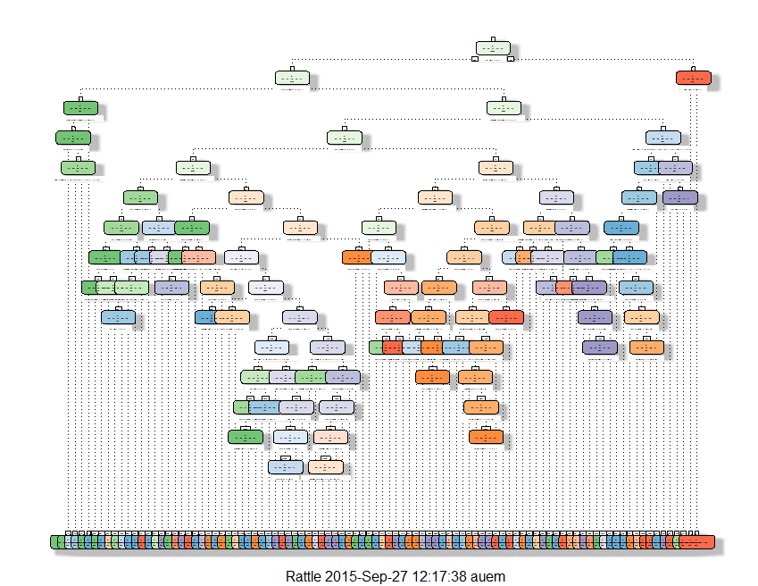

This is the documentation of the course project of  Coursera's "The Data Scientist's Toolbox - Practical Machine Learning" .

### Part 1: Preparation of data sample

In the first part, the data sample is prepared for the model estimation. For this purpose, explanatory attributes of the data sample are binned and/or transformed.

Numeric attributes are binned into segments and class attributes created as well as a standardised.
Factor attributes are only re-segmented in order to classify missing values and aggregate data with scarce values to a Rest-class.

Creation of Binning-Function to Bin/Transform explanatory attributes:

```r
## Generic binning of attributes
#   Required: Input table with attributes that should be binned
#   First few columns are missed out: Binning starts with attribut i
#   Also, an attribut called "Target" at the end of the data sample is not binned
library(data.table)

binning <- function(daten, i) {
  # daten: input data set 
  # i: first attribute of data set in order to exclude row_id or something like that
  
  max <- ncol(daten)
  
  while(i <= max & colnames(daten)[i] != "Target")
  {
    myvar <-  daten[[i]]
    varname=paste(colnames(daten)[i], "_CLS", sep = "")
    varname2=paste(colnames(daten)[i], "_TF", sep = "")
    if(is.numeric(myvar)){ # Binning of numeric attributes
      try(daten$myvar <- cut(myvar, breaks=unique(quantile(myvar,probs=seq(0,1,0.2), na.rm=T)), include.lowest = TRUE, right=TRUE))
      
      
      # Refactor missing values
      if (length(daten$myvar[is.na(daten$myvar) == TRUE]) > 0 ) {
        daten$myvar <- factor(daten$myvar, levels = c(levels(daten$myvar), "NULL"))
        daten$myvar[is.na(daten$myvar)] <- "NULL"
      }
      
      # Only keep if between 2 and 19 classes
      if (length(levels(daten$myvar)) > 1 & length(levels(daten$myvar)) < 20 ) {
        setnames(daten,"myvar",varname)
      }
    }   
    
        if(is.numeric(myvar)){ # Transformation of numeric attributes
          daten$myvar <-(myvar - mean(myvar)) / sd(myvar)  
          
          if (length(daten$myvar[!is.na(daten$myvar)]) > 0 ) {
            setnames(daten,"myvar",varname2)
          } else {
            daten <- subset( daten, select = -myvar )
          }
        }
    
    if(is.factor(myvar)){ # Binning of factor-attributes
      ## Put classes lower 5% into Rest-class
      daten$myvar <- myvar
      
      # Refactor missing values
      if (length(daten$myvar[is.na(daten$myvar) == TRUE | daten$myvar == ""]) > 0 ) {
        daten$myvar <- factor(daten$myvar, levels = c(levels(daten$myvar), "NULL"))
        daten$myvar[is.na(daten$myvar)] <- "NULL"
        daten$myvar[daten$myvar == ""] <- "NULL"
      }
      
            mytab.pro <- prop.table(table(daten$myvar))*100       # %-distribution
            daten$myvar <- factor(daten$myvar, levels = c(levels(daten$myvar), "REST"))
            daten$myvar[daten$myvar %in% names(mytab.pro[mytab.pro < 5.0])] <- "REST"
            daten$myvar <- factor(daten$myvar)
      
      if (length(levels(daten$myvar)) > 1 & length(levels(daten$myvar)) < 20 ) {
        setnames(daten,"myvar",varname)
      }
    }  
    i = i+1
  }
  test <- colnames(daten)[colnames(daten) %like% "_CLS" | colnames(daten) %like% "_TF"  | colnames(daten) == "Target"]
  subset(daten, select=test)  
}
```
Now load the data (Training-sample) and apply the variable binning function on it.
After that, focus only on the new attributes and the Target-criterion (class attribute of original data sample).

```r
# Load training data sample
pml.training <- read.csv("pml-training.csv", header=TRUE)

# Rename Target-criterion (necessary for generic function)
pml.training$Target <- pml.training$classe
data_ana  <- binning(pml.training, 6)

# Select only new attributes
selection <- colnames(data_ana)[(colnames(data_ana) %like% "_CLS" | colnames(data_ana) %like% "_TF" | colnames(data_ana) == "Target") & colnames(data_ana) != "classe_CLS"  & colnames(data_ana) != "problem_id_CLS"]
data_ana <- subset(data_ana, select=selection)  
```

### Part 2: Development of Machine Learning Model

In this part, a model to estimate the Target criterion "classe" is developed and evaluated.

For this case, a decision tree algorithm is applied. The R-package "rpart" with implemented CART-decision trees is used for this purpose. To begin with, the training data sample is split into new training and testing sample in order to evaluate predictive power of the model later.


```r
# Load necessary packages
library(caret)
library(rpart)

# Split data sample randomly (3/4 training, 1/4 testing)
set.seed(125)

inTrain = createDataPartition(data_ana$Target, p = 3/4)[[1]]
training = data_ana[ inTrain,]
testing = data_ana[-inTrain,]

# Fit the model (CART decision tree)
modelFit <- rpart(Target ~ .
                , data= training
                , method="class"
                , control = rpart.control(minbucket = 20, cp = 0.00001, maxdepth = 15)
                )
```
The parameters of the model where chosen considering accuracy in training and testing sample. In this report, only the final model is presented.

The get an impression of the whole tree, R-package "rattle" is applied. The tree is too big to see details (See the graph in folder "figure" if not visible here):


```r
library(rattle)
fancyRpartPlot(modelFit) 
```

 

Considering the descriptive power of the model, the accuracy for the testing and the training data has to be compared.
Testing data sample:

```r
confusionMatrix(testing$Target,predict(modelFit, testing, type = "class"))
```

```
## Confusion Matrix and Statistics
## 
##           Reference
## Prediction    A    B    C    D    E
##          A 1351   16   11   10    7
##          B   43  793   67   41    5
##          C    2   17  815   11   10
##          D    2   26   46  719   11
##          E   15   19   16   21  830
## 
## Overall Statistics
##                                           
##                Accuracy : 0.9192          
##                  95% CI : (0.9113, 0.9267)
##     No Information Rate : 0.2881          
##     P-Value [Acc > NIR] : < 2.2e-16       
##                                           
##                   Kappa : 0.8979          
##  Mcnemar's Test P-Value : 8.144e-16       
## 
## Statistics by Class:
## 
##                      Class: A Class: B Class: C Class: D Class: E
## Sensitivity            0.9561   0.9104   0.8534   0.8965   0.9618
## Specificity            0.9874   0.9613   0.9899   0.9793   0.9824
## Pos Pred Value         0.9685   0.8356   0.9532   0.8943   0.9212
## Neg Pred Value         0.9823   0.9803   0.9654   0.9798   0.9918
## Prevalence             0.2881   0.1776   0.1947   0.1635   0.1760
## Detection Rate         0.2755   0.1617   0.1662   0.1466   0.1692
## Detection Prevalence   0.2845   0.1935   0.1743   0.1639   0.1837
## Balanced Accuracy      0.9718   0.9359   0.9216   0.9379   0.9721
```
Training data sample:

```r
confusionMatrix(training$Target,predict(modelFit, training, type = "class"))
```

```
## Confusion Matrix and Statistics
## 
##           Reference
## Prediction    A    B    C    D    E
##          A 4061   45   33   26   20
##          B   78 2500  152  103   15
##          C   13   31 2454   47   22
##          D   11   35  101 2247   18
##          E   40   45   41   57 2523
## 
## Overall Statistics
##                                           
##                Accuracy : 0.9366          
##                  95% CI : (0.9326, 0.9405)
##     No Information Rate : 0.2856          
##     P-Value [Acc > NIR] : < 2.2e-16       
##                                           
##                   Kappa : 0.9198          
##  Mcnemar's Test P-Value : < 2.2e-16       
## 
## Statistics by Class:
## 
##                      Class: A Class: B Class: C Class: D Class: E
## Sensitivity            0.9662   0.9413   0.8824   0.9060   0.9711
## Specificity            0.9882   0.9711   0.9905   0.9865   0.9849
## Pos Pred Value         0.9704   0.8778   0.9560   0.9316   0.9324
## Neg Pred Value         0.9865   0.9869   0.9731   0.9811   0.9938
## Prevalence             0.2856   0.1805   0.1890   0.1685   0.1765
## Detection Rate         0.2759   0.1699   0.1667   0.1527   0.1714
## Detection Prevalence   0.2843   0.1935   0.1744   0.1639   0.1839
## Balanced Accuracy      0.9772   0.9562   0.9365   0.9463   0.9780
```
As we see in the comparison of the confusion matrix for testing and training data sample, the accuracy is quite close (0.919 % vs. 0.937). Therefore, there is no overfitting of the model visible.
On the other hand, the model seems quite good (over 90% correct in the testing sample). Therefore a simple decision tree approach seems adequate for this problem.
